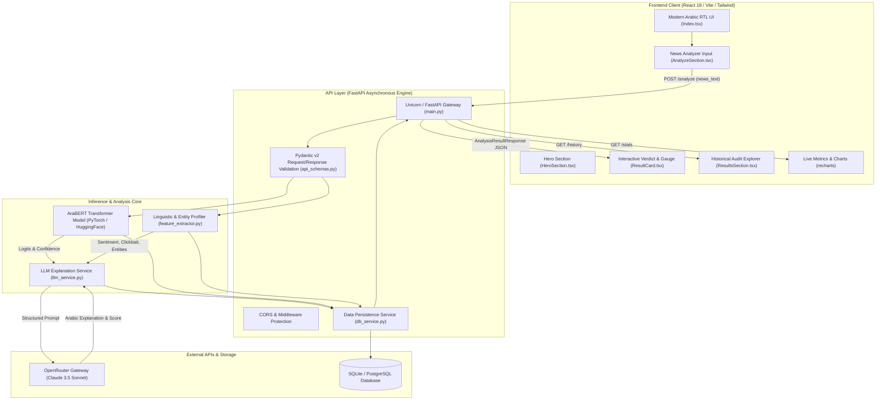
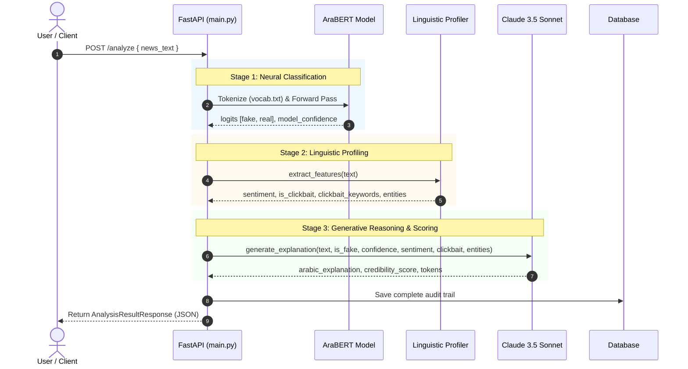

<br/><br/>

<!-- Animated Title -->
<p align="center">
  <a href="#">
    
  </a>
</p>

<p align="center">
  <b>Enterprise-Grade AI Platform for Arabic Misinformation Detection & Content Credibility Scoring</b><br/>
  <i>Hybrid Neural Classification · Explainable Generative Verification · Multi-Feature Linguistic Profiling · Production-Ready Microservices</i>
</p>

<br/>

<!-- Badges Row 1: Core Technologies -->
<p align="center">
  
  
  
  
  
  
</p>

<!-- Badges Row 2: AI & Infrastructure -->
<p align="center">
  
  
  
  
  
</p>

<!-- Badges Row 3: Standards & Status -->
<p align="center">
  
  
  
  
</p>

<br/>

<!-- Quick Navigation Bar -->
<p align="center">
  <a href="#-overview"></a>
  &nbsp;
  <a href="#-problem-statement--solution"></a>
  &nbsp;
  <a href="#-core-capabilities"></a>
  &nbsp;
  <a href="#%EF%B8%8F-system-architecture"></a>
  &nbsp;
  <a href="#-machine-learning--nlp-pipeline"></a>
  &nbsp;
  <a href="#-api-endpoints-reference"></a>
  &nbsp;
  <a href="#-operations--quickstart"></a>
</p>

---

## 📌 Overview

**Mesdaq AI (مِصْدَاق)** is an enterprise-grade artificial intelligence platform engineered specifically for **Arabic news verification, misinformation detection, and content credibility scoring**. Built to tackle the unique linguistic intricacies, morphological density, and dialectal variations of the Arabic language, Mesdaq AI bridges the gap between raw machine learning classification and human-interpretable reasoning.

The platform unites an optimized **AraBERT** deep learning transformer model with **Claude 3.5 Sonnet** (orchestrated via OpenRouter) to deliver a dual-layer verification mechanism:
1. **Deterministic Statistical Classification**: High-throughput neural classification detecting deception patterns, clickbait triggers, and structural anomalies.
2. **Contextual Generative Reasoning (XAI)**: Synthesizing contextual justifications, evidence checklists, source credibility ratings, and actionable indicators in natural Arabic.

```
                  ┌────────────────────────────────────────────────────────┐
                  │                 Mesdaq AI Engine                       │
                  │                                                        │
[ Arabic News ] ──┼──> [ AraBERT Classifier ] ──> Statistical Verdict    ├──> [ Comprehensive Report ]
                  │             │                                          │    - Credibility Score (0-100)
                  │             ▼                                          │    - Misinformation Flag
                  │    [ Linguistic Profiler ] ──> Sentiment & Clickbait   │    - XAI Rationale (Arabic)
                  │             │                                          │    - Entity Extraction
                  │             ▼                                          │    - Verification Steps
                  │    [ Claude 3.5 Sonnet ]   ──> Structured Reasoning    │
                  └────────────────────────────────────────────────────────┘
```

---

## 🎯 Problem Statement & Solution

<table>
<tr>
<td width="50%" valign="top">

### ❌ The Arabic Misinformation Crisis

Arabic digital media faces unprecedented challenges that generic global NLP models fail to address:

- 🌪️ **High Velocity of Viral Misinformation**: Fabricated narratives spread unchecked across social media, messaging apps, and blogs.
- 🗣️ **Morphological & Dialectal Complexity**: Arabic's rich root system, affixes, and colloquial nuances cause standard foreign models to hallucinate or misclassify.
- 📉 **Black-Box Confusion**: Simple binary flags ("Fake" vs "Real") fail to convince users without transparent, evidence-based reasoning.
- 🎣 **Sensationalist Clickbait**: Misleading headlines distort authentic content to drive advertising clicks.
- ⏱️ **Manual Fact-Checking Bottlenecks**: Human editorial verification takes hours, while misinformation peaks within minutes.

</td>
<td width="50%" valign="top">

### ✅ The Mesdaq AI Solution

| Challenge | Mesdaq AI Architectural Solution |
| :--- | :--- |
| **Linguistic Nuance** | Fine-tuned **AraBERT** specialized in Arabic syntax, semantics, and rhetoric. |
| **Explainability** | **Claude 3.5 Sonnet XAI** delivers paragraph-level Arabic justifications and source validation. |
| **Credibility Granularity** | Calibrated **0–100 Credibility Index** factoring confidence, sentiment, clickbait, and entities. |
| **Clickbait Extraction** | Heuristic & regex-driven pattern analyzer isolating sensationalist terminology. |
| **Real-Time Speed** | Asynchronous **FastAPI** backend delivering complete inference and reasoning in sub-second to low-second latency. |
| **Production Ready** | Full Docker Compose orchestration with persistence, metrics tracking, and history storage. |

</td>
</tr>
</table>

---

## 🔥 Core Capabilities

<table>
<tr>
<td width="33%" align="center" valign="top">

### 🤖 Neural Classification
<br/>
<b>Fine-Tuned AraBERT Model</b>
<p align="left">
• Binary classification (Real vs Fake)<br/>
• Calibrated softmax confidence scoring<br/>
• Raw logit extraction and tracking<br/>
• Optimized PyTorch CPU/GPU inference<br/>
• High-performance batch evaluation
</p>

</td>
<td width="33%" align="center" valign="top">

### 🧠 Explainable AI (XAI)
<br/>
<b>Claude 3.5 Sonnet Reasoning</b>
<p align="left">
• Natural language Arabic explanations<br/>
• Contextual fact-checking rationale<br/>
• Identification of logical fallacies<br/>
• Source credibility checklists<br/>
• Recommended verification actions
</p>

</td>
<td width="33%" align="center" valign="top">

### 🔍 Linguistic Profiling
<br/>
<b>Multi-Feature Extractor</b>
<p align="left">
• Clickbait indicator & trigger detection<br/>
• Sentiment polarity (Positive/Neutral/Negative)<br/>
• Named Entity Recognition (Persons, Orgs, Locs)<br/>
• Structural word & token statistics<br/>
• Dialectal & emotional intensity scoring
</p>

</td>
</tr>
</table>

---

## 🏗️ System Architecture

Mesdaq AI is architected as a modular, decoupled platform comprising a high-performance **FastAPI backend microservice**, an interactive **React/Vite single-page application**, a local **PyTorch Transformer inference engine**, and an external **LLM reasoning gateway**.

### Component Topology & Data Flow



---

## 🔬 Machine Learning & NLP Pipeline

The analysis pipeline operates in three synchronized stages upon receiving an Arabic text payload:



### 1. AraBERT Neural Classification
- **Base Architecture**: AraBERT (Arabic BERT) pre-trained on massive Modern Standard Arabic (MSA) corpora and news datasets.
- **Classification Head**: `BertForSequenceClassification` mapping contextual 768-dimensional token embeddings to a 2-class probability distribution via calibrated softmax.
- **Logit Calibration**: Returns both raw logits (`logits_fake`, `logits_real`) and normalized probability confidence.

### 2. Linguistic & Stylistic Feature Extraction
- **Clickbait Detector**: Scans for urgency triggers, superlative exaggerations, and sensationalist phrasing common in fabricated clickbait (e.g., *"لن تصدق"*, *"شاهد قبل الحذف"*, *"كارثة تهز"*).
- **Sentiment Polarity**: Lexicon-calibrated sentiment classification determining whether the text carries emotional manipulation, fear-mongering, or neutral reporting.
- **Named Entity Recognition**: Counts and classifies mentioned political figures, corporations, institutions, and geographic locations to assess verifiable context density.

### 3. Generative Reasoning Engine (Claude 3.5 Sonnet)
Constructs an expert Arabic prompt incorporating the article content alongside the AraBERT classification results and linguistic profile, asking the LLM to:
- Formulate a precise, multi-perspective justification in professional Arabic.
- Compute a multi-factor **Credibility Score** between 0 and 100.
- Highlight red flags, logical leaps, or unverified claims.

---

## ⚙️ Technical Stack

| Layer | Technology | Purpose & Implementation Details |
| :--- | :--- | :--- |
| **Frontend Framework** | **React 18 + Vite 6** | Fast Single Page Application with optimized bundle splitting |
| **Language & Typing** | **TypeScript 5.x** | End-to-end type safety across components, states, and API responses |
| **Styling & Design** | **Tailwind CSS + Shadcn UI** | Sleek modern aesthetics, Radix UI primitives, native RTL support |
| **Animations & Visuals** | **Framer Motion + Recharts** | Smooth transition effects, confidence gauges, and historical analytics |
| **Backend Framework** | **FastAPI 0.104+** | Asynchronous, OpenAPI-documented Python REST microservice |
| **Deep Learning** | **PyTorch + HuggingFace** | `BertForSequenceClassification` running fine-tuned AraBERT |
| **Tokenizer & Vocab** | **AraBERT Tokenizer** | 64k-wordpiece Arabic specialized vocabulary (`vocab.txt`, `tokenizer.json`) |
| **LLM Gateway** | **OpenRouter API** | Anthropic Claude 3.5 Sonnet integration for structured reasoning |
| **Data Persistence** | **SQLAlchemy + SQLite/PostgreSQL** | Audit logging, model metrics, execution latency, and analytics |
| **Containerization** | **Docker & Docker Compose** | Multi-stage production builds for backend and Nginx-powered frontend |

---

## 📁 Repository Structure

```
Mesdaq_AI/
├── 📄 main.py                      # FastAPI application entry point, lifecycle & route handlers
├── 📄 api_schemas.py               # Pydantic v2 validation models for requests & responses
├── 📄 database_models.py           # SQLAlchemy ORM models (Analysis audit, metrics, users)
├── 📄 db_service.py                # Database repository layer, CRUD queries & pagination
├── 📄 feature_extractor.py         # Sentiment analysis, clickbait heuristics & entity extractor
├── 📄 llm_service.py               # Claude 3.5 Sonnet OpenRouter reasoning & scoring client
├── 📄 config.json                  # Model hyperparameters, thresholds & environment mappings
├── 📄 requirements.txt             # Python backend dependencies
├── 📄 Dockerfile                   # Multi-stage production container for FastAPI backend
├── 📄 docker-compose.yml           # Unified orchestration (FastAPI + React Frontend + DB)
├── 📄 render.yaml                  # Cloud deployment configuration for Render
├── 📄 DEPLOYMENT.md                # Production infrastructure & deployment manual
├── 📄 start.bat                    # One-click Windows development launcher
├── 📄 vocab.txt                    # AraBERT vocabulary file
├── 📄 tokenizer.json               # Fast tokenizer serialization
├── 📄 tokenizer_config.json        # Tokenizer special tokens and padding parameters
├── 📄 label_encoder.pkl            # Scikit-learn serialized label mappings
│
└── 📁 mesdaq-main/                 # Modern React 18 Frontend Application
    ├── 📄 package.json             # Frontend dependencies, scripts & metadata
    ├── 📄 vite.config.ts           # Vite build tool configuration & proxy rules
    ├── 📄 tailwind.config.ts       # Tailwind CSS theme configuration (Arabic RTL)
    ├── 📄 tsconfig.json            # TypeScript compiler configuration
    ├── 📄 nginx.conf               # Production Nginx reverse proxy configuration
    ├── 📄 Dockerfile               # Multi-stage Nginx container for production frontend
    │
    └── 📁 src/                     # Frontend Source Code
        ├── 📄 App.tsx              # Root React component, QueryClient & React Router
        ├── 📄 main.tsx             # DOM mounting entry point
        ├── 📁 pages/               # Application Pages
        │   ├── 📄 Index.tsx        # Main dashboard (Analyzer, Gauges, History, Stats)
        │   └── 📄 NotFound.tsx     # 404 handler
        ├── 📁 components/          # Reusable UI & Feature Components
        │   ├── 📄 Navbar.tsx       # Brand header, navigation & quick actions
        │   ├── 📄 HeroSection.tsx  # Dynamic introductory section
        │   ├── 📄 AnalyzeSection.tsx # Text input editor with preset sample articles
        │   ├── 📄 ResultCard.tsx   # Detailed verdict, gauge, entities & XAI accordion
        │   ├── 📄 ResultsSection.tsx # Historical analyses list & search
        │   ├── 📄 FeaturesSection.tsx# Core architecture & value propositions
        │   ├── 📄 HowItWorksSection.tsx # Interactive workflow guide
        │   └── 📁 ui/              # Shadcn UI accessible design primitives
        └── 📁 lib/                 # Utility functions & API client helpers
```

---

## 🌐 API Endpoints Reference

All endpoints are self-documenting via Swagger UI at `/docs` or ReDoc at `/redoc`.

### 1. News Analysis
- **`POST /analyze`**
  - **Description**: Submits an Arabic news text for full neural classification, linguistic profiling, and Claude 3.5 Sonnet reasoning.
  - **Request Body**:
    ```json
    {
      "news_text": "عاجل: وزارة الصحة تعلن عن إجراءات وقائية جديدة للحد من انتشار الفيروسات الموسمية..."
    }
    ```
  - **Response (`200 OK`)**:
    ```json
    {
      "analysis_id": 142,
      "is_fake": false,
      "credibility_score": 88,
      "explanation": "الخبر صادر بأسلوب رسمي ومهني، متطابق مع البيانات الحكومية المعتادة دون استخدام ألفاظ تهويلية أو إشارات كليك بيت.",
      "prediction_details": {
        "model_confidence": 0.942,
        "logits_fake": -2.45,
        "logits_real": 3.12,
        "sentiment": "neutral",
        "is_clickbait": false,
        "clickbait_keywords": null,
        "entity_person_count": 0,
        "entity_org_count": 1,
        "entity_loc_count": 0,
        "word_count": 68
      },
      "explanation_data": {
        "llm_model": "anthropic/claude-3.5-sonnet",
        "llm_provider": "openrouter",
        "explanation": "تم التحقق من صياغة الخبر ومطابقتها للمعايير الصحفية...",
        "prompt_tokens": 580,
        "completion_tokens": 165
      },
      "created_at": "2026-09-12T11:25:00"
    }
    ```

### 2. Historical Audits & Analytics
- **`GET /history?limit=10&offset=0`**: Retrieves paginated historical verification audits.
- **`GET /stats`**: Returns aggregate system statistics (total analyses, fake percentage, average credibility score, 24h activity).
- **`GET /health`**: Health check probe returning database connectivity, model loaded status, and LLM readiness.

---

## 🚀 Operations & Quickstart

### Prerequisites
- **Python**: Version 3.10 or higher
- **Node.js**: Version 18.x or higher (or Bun)
- **OpenRouter API Key**: For Claude 3.5 Sonnet reasoning (get one at [openrouter.ai](https://openrouter.ai))

---

### 1. Environment Configuration

Create a `.env` file in the root directory:

```bash
# Server Configuration
PORT=8000
ENVIRONMENT=development
DATABASE_URL=sqlite:///./mesdaq.db

# OpenRouter API (Claude 3.5 Sonnet)
OPENROUTER_API_KEY=your_openrouter_api_key_here

# Optional: CORS Origins
ALLOWED_ORIGINS=http://localhost:5173,http://localhost:3000
```

---

### 2. Manual Development Setup

#### Step A: Backend (FastAPI)
```bash
# 1. Create and activate a virtual environment
python -m venv venv
source venv/bin/activate        # On Windows: .\venv\Scripts\activate

# 2. Install backend dependencies
pip install -r requirements.txt

# 3. Launch FastAPI backend server
uvicorn main:app --host 0.0.0.0 --port 8000 --reload
```
*The API is now running at `http://localhost:8000` (Docs: `http://localhost:8000/docs`).*

#### Step B: Frontend (React / Vite)
```bash
# 1. Navigate to the frontend directory
cd mesdaq-main

# 2. Install dependencies
npm install                     # Or: bun install

# 3. Start development server
npm run dev                     # Or: bun dev
```
*The UI is now accessible at `http://localhost:5173`.*

---

### ⚡ One-Click Windows Launch

Run the included automated launch script:
```powershell
.\start.bat
```
*This starts both the backend API and frontend dev server simultaneously in configured terminal tabs.*

---

### 🐳 Docker & Docker Compose Deployment

Run the complete multi-container stack in isolated production mode:

```bash
# Build and start all services in the background
docker-compose up -d --build

# View container logs
docker-compose logs -f

# Stop containers
docker-compose down
```

---

## 🛡️ Production Guardrails & Sanitization

1. **Input Boundary Validation**: Strict Pydantic v2 length bounds (10 to 5,000 characters) prevent denial-of-service and buffer exhaustion attacks.
2. **Text Normalization**: Automatic Arabic Unicode normalization (Alef, Taa Marbuta, Hamza unification) removes adversarial obfuscation tricks.
3. **Graceful Degradation**: If the external OpenRouter API is unavailable or times out, the system automatically falls back to deterministic rule-based Arabic explanations generated from AraBERT confidence and linguistic features without throwing an uncaught 500 error.
4. **Structured Token Caps**: Output tokens for generative explanations are strictly bounded (`max_tokens=400`) to prevent runaway costs and guarantee predictable latency.

---

## 👥 Author & Connect

**Ibrahim Abdelsattar**  
*AI Engineer & Machine Learning Specialist*

- 🌐 **GitHub**: [@IbrahimAbdelsattar](https://github.com/IbrahimAbdelsattar)
- 💼 **LinkedIn**: [Ibrahim Abdelsattar](https://www.linkedin.com/in/ibrahim-abdelsattar/)
- 📧 **Email**: [ibrahimabdelsattar042@gmail.com](mailto:ibrahimabdelsattar042@gmail.com)

---

<p align="center">
  <sub>Built with ❤️ for reliable Arabic AI & Information Integrity. © 2026 Mesdaq AI.</sub>
</p>
